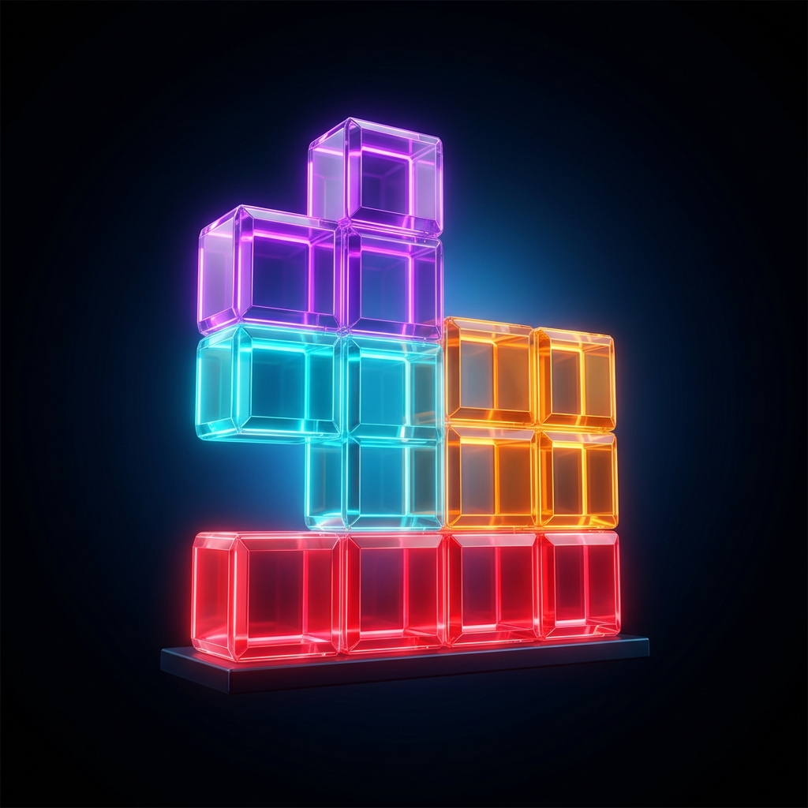
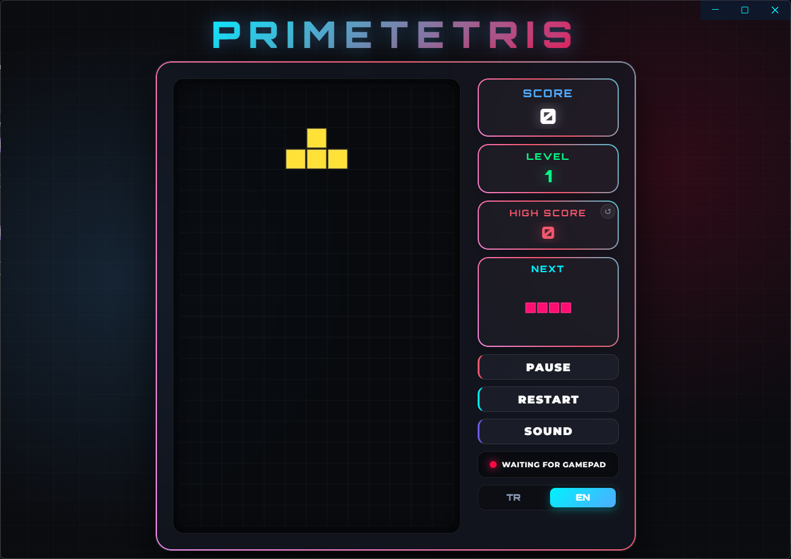
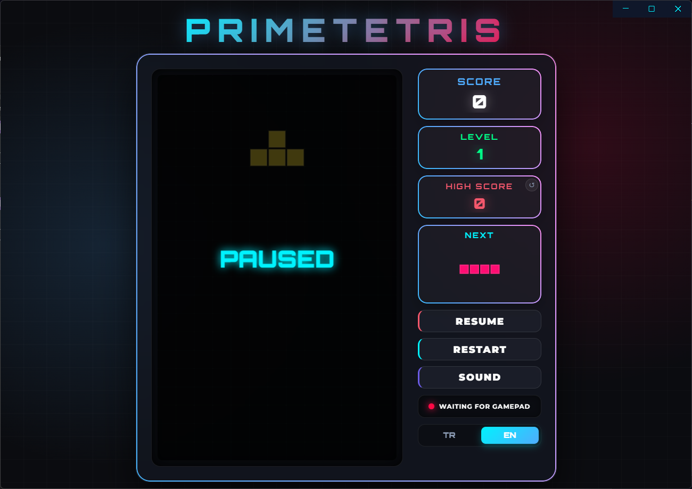
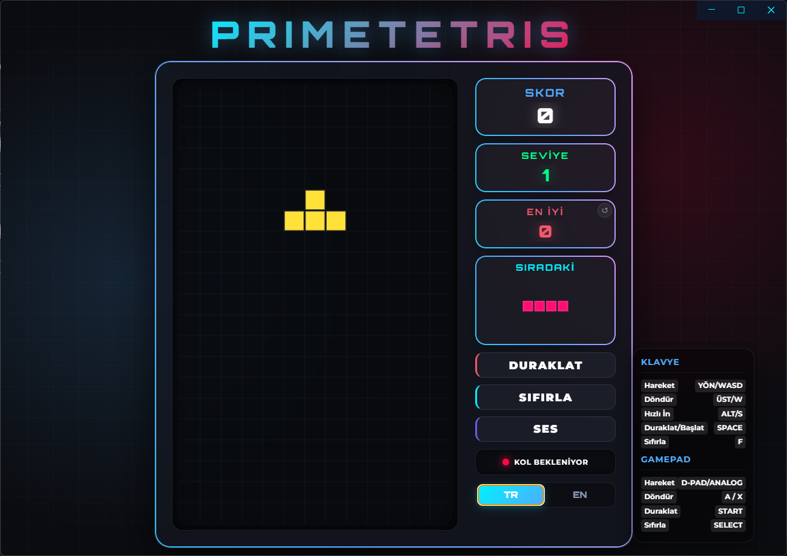

<p align="center">
  
</p>

# 🎮 PrimeTetris

**PrimeTetris** is a modern, feature-packed retro-futuristic Tetris game built with Electron, Web Audio API, dynamic neon glassmorphism UI, Gamepad support, multi-language localization (EN/TR), and high score management.

---

## 🌟 Key Features

- 🎨 **Modern Neon Glassmorphism UI**: Sleek cyber-retro aesthetic with dynamic animated glowing borders.
- 🌐 **Multi-Language Support (EN / TR)**: Instant one-click toggle between English and Turkish (starts in English by default).
- 🔄 **High Score Reset**: One-click high score reset with smooth visual animations.
- 🎮 **Gamepad & Keyboard Controllers**: Full support for both keyboard and Gamepad (Xbox/PlayStation/Generic controllers) with auto-detection.
- 🔊 **Web Audio API Sound Effects**: Retro synthesized sound effects for piece drop, line clears, level ups, and game over.
- ⚡ **Portable Desktop App & Web Ready**: Cross-platform ready, packageable into a single standalone portable `.exe`.

---

## 📸 Highlights & Gameplay

<p align="center">
  
  
  
</p>

- 🕹️ **Dual-Language Interface**: Seamlessly switch between English and Turkish on the fly.
- ⏸️ **Interactive Pause & Overlay**: Crisp paused screen graphics and modal game over overlays.
- 🎯 **Responsive Scoreboard**: Real-time score, level progression, next piece preview, and high score tracking.

---

## 🛠️ Installation & Getting Started

Clone the repository and install dependencies:

```bash
# Clone the repository
git clone https://github.com/MaximusPrime77/PrimeTetris.git

# Navigate into the project directory
cd PrimeTetris

# Install dependencies
npm install
```

### Run in Development Mode
```bash
npm run dev
# or
npm start
```

### Build Portable Executable
To generate the standalone `.exe` portable file:
```bash
npm run build
```

---

## 🎮 Game Controls

| Action | Keyboard | Gamepad |
| :--- | :--- | :--- |
| **Move** | Arrow Keys / A-D | D-Pad / Left Analog |
| **Rotate** | Up Arrow / W | A / X Buttons |
| **Soft Drop** | Down Arrow / S | D-Pad Down / Analog |
| **Pause / Resume** | Space / P / Esc | Start Button |
| **Restart Game** | F | Select Button |

---

## 📄 License

This project is licensed under the [MIT License](LICENSE).

Developed with ❤️ by Maximus Decimus Meridius.
